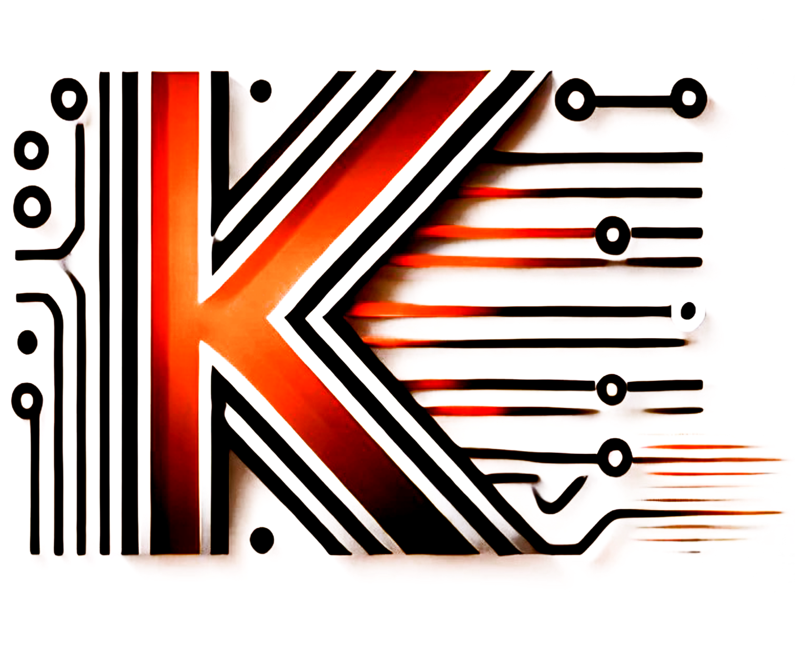

#  K-Tech: 
**Discover, Share, and Vote on Innovative Products**

[Live Site URL](https://k-tech.example.com) **https://k-tech.example.com**

---

## Features

- **User-Friendly Product Management**: Users can post products, view their submissions, update product details, and manage their content seamlessly.
- **Dynamic Product Review Queue**: Moderators can review, accept, reject, or feature products with intuitive actions directly on the dashboard.
- **Reported Content Management**: Handle reported products effectively, with options to view details and remove inappropriate content.
- **Membership Benefits**: A subscription plan that allows users to post unlimited products, removing restrictions for normal users.
- **Interactive Home Layout**: Includes sections for Featured Products, Explore Categories, FAQs, and more for a polished and engaging user experience.

---

## Technologies Used

### **Frontend**
- **React.js**: For building reusable components and managing the UI.
- **React Router**: To handle routing and navigation.
- **Tailwind CSS**: For responsive and modern styling.
- **React Hook Form**: For managing and validating forms.
- **React Tags**: For handling tag-based inputs in forms.
- **React Icons**: For clean and modern icons across the site.
- **SweetAlert2**: For stylish pop-up notifications and confirmations.
- **Axios**: For HTTP requests between frontend and backend.
- **react-swiper**: To make the banner components.
- **Tanstack/React-query**: For HTTP requests between frontend and backend.

### **Backend**
- **Express.js**: To build RESTful APIs for the application.
- **MongoDB**: For the database to store product and user-related data (without Mongoose).
-**JWT**: To make the website more secure.
---

## Additional Features
- **State Management**: Leveraging React's Context API to manage user authentication and global states.
- **Dynamic Sorting and Filtering**: For tables and product listings based on status or user preferences.
- **Membership Plan Integration**: Restriction handling for free users, and subscription-based unlimited product posting.
- **Interactive UI Components**: Includes hover effects, tooltips, buttons, and modals for better user experience.

---

**Thank You**
- K-Tech Team.

